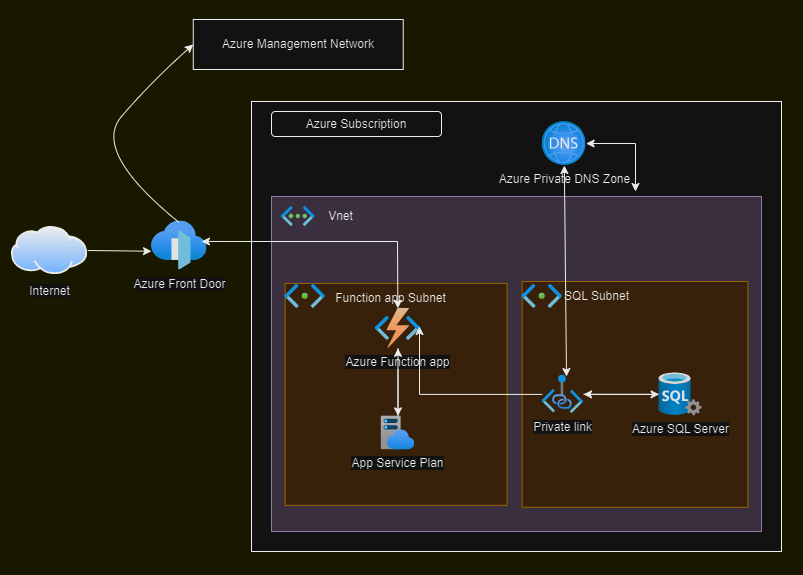

### Prerequestics before running this pipeline:

For security reasons, I have used Azure Library to store all the variables. So please ensure to have Azure variable library named "dev-variables" and below parameters created

    Your subscription connection name
    - subscription

    Preferred SQL login account name
    - adminLogin

    Name for Function App
    - appName

    Name for Front Door
    - frontDoorName

    Keyvault name of an existing resource you wise to save SQL server login password and service principle has Keyvault Secret user permission in order to write secret
    - keyvaultName

    Preferred Location
    - location

    Name for Resource Group 
    - resourceGroupName

    For scalability, you can specify the SKU capacity from 1 to 10
    - skuCapacity

    For testing used Standard, so the SKU name will be 'S1'
    - skuName

    Default domain name as 'database.windows.net'
    - sqlServerDomain

    Name for SQL Server
    - sqlServerName

    For security reasons, I have used self hosted agent. Please supply the agent pool name and agent name from your environment or you can replace with VMImage
    - agentPoolName
    - agentName

    Sonarcloud Security project key and name
    - cliProjectKey
    - cliProjectName

    Organization name
    - organization

**Architectural Design:**

**Deployment Pipeline**

Deployment pipeline file available in Environment folder named 'deployment.yml' 

For template validation and testing, I have added WHAT IF condition. 